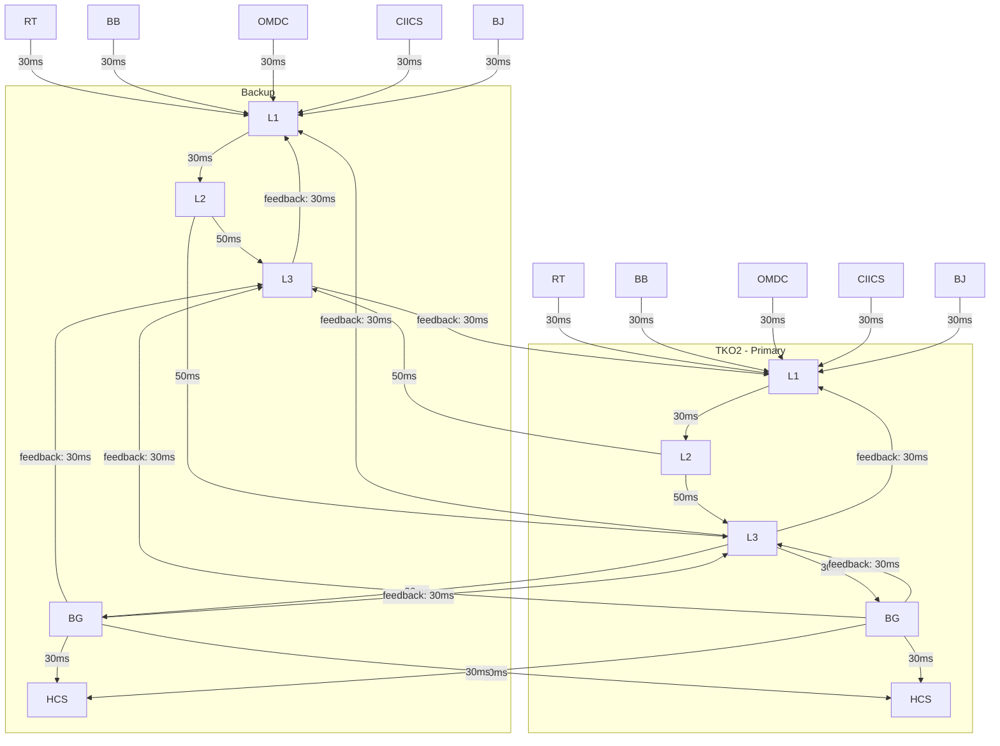

## v1
src/web/v0/index-latency-monitor.html 是股指指数计算系统的监控页面(v0版本)， image001.png 是其效果图，系统分为L1,L2,L3,BG,HCS各个模块，系统使用分布式部署到TKO1, TKO2两个数据中心。 请重
  新设计该页面的v2版本，提供html模板用于效果预览，无需后台功能.

## v5
增加按钮点击只选择primary / site 
线条颜色，粗细，虚实，闪烁，highlight等效果区分不同的连接状态，如正常，异常，延迟等。
启用sst方式实时更新节点信息和时延，当数据出现异常时，线条闪烁并高亮显示异常数据，点击线条可以查看详细信息。
各个module的背景颜色区分不同模块

如果你还想进一步提升可读性，下一步最有效的是把不同类型的线再做成不同曲率，或者给 cross / feedback 增加不同的箭头样式。

数据更新:
  1. 页面加载时先调用一个 REST API 获取当前完整快照
  2. 再建立 SSE 连接持续接收增量更新
  3. 服务端按模块或链路推事件
     例如：latency_update、alert_update、topology_status
  4. 前端按模块 ID 局部更新 DOM / 图表，不整页刷新
  5. 加心跳和超时提示
     例如 10-15 秒无消息就标记连接异常

将页面展示演示做成可配置的方式，比如： 

  - TKO2-L3 -> TKO1-BG : (842, 688) -> (380, 812)
  - TKO2-BG -> TKO2-L3 : (842, 852) -> (842, 688)
  - TKO1-BG -> TKO2-L3 : (380, 852) -> (842, 688)

