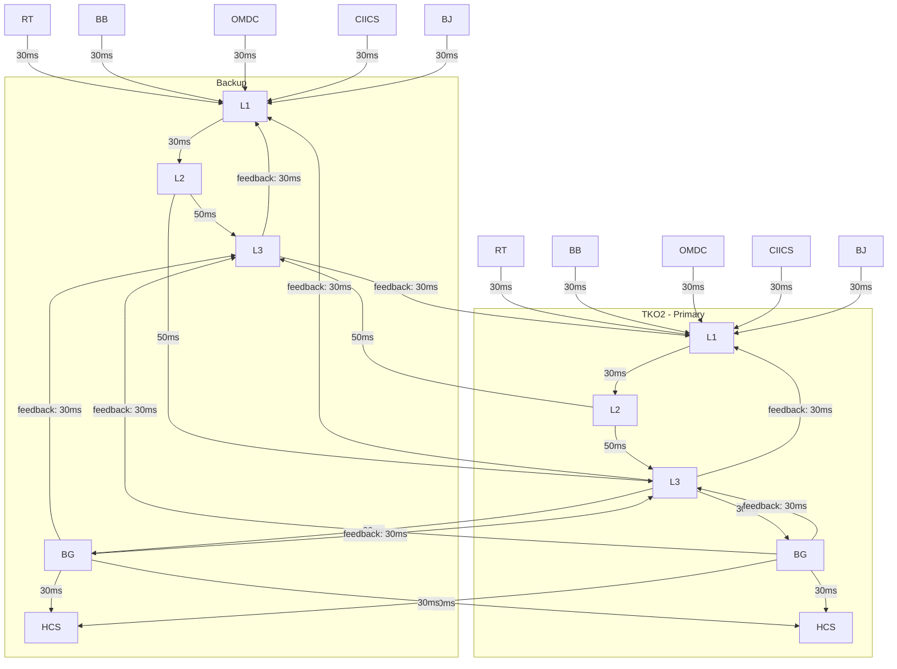

## v1
src/web/v0/index-latency-monitor.html 是股指指数计算系统的监控页面(v0版本)， image001.png 是其效果图，系统分为L1,L2,L3,BG,HCS各个模块，系统使用分布式部署到TKO1, TKO2两个数据中心。 请重
  新设计该页面的v2版本，提供html模板用于效果预览，无需后台功能.

## v5
增加按钮点击只选择primary / site 
线条颜色，粗细，虚实，闪烁，highlight等效果区分不同的连接状态，如正常，异常，延迟等。
启用sse方式实时更新节点信息和时延，当数据出现异常时，线条闪烁并高亮显示异常数据，点击线条可以查看详细信息。
各个module的背景颜色区分不同模块

如果你还想进一步提升可读性，下一步最有效的是把不同类型的线再做成不同曲率，或者给 cross / feedback 增加不同的箭头样式。

数据更新:
  1. 页面加载时先调用一个 REST API 获取当前完整快照
  2. 再建立 SSE 连接持续接收增量更新
  3. 服务端按模块或链路推事件
     例如：latency_update、alert_update、topology_status
  4. 前端按模块 ID 局部更新 DOM / 图表，不整页刷新
  5. 加心跳和超时提示
     例如 10-15 秒无消息就标记连接异常

## 将页面展示演示做成可配置的方式，比如： 

重构”VERTICAL TRIPLE-TOWER TOPOLOGY“中线路的展示效果。 
将当前的link.kind按以下进行分类: intra, primary, backup, feedback；
重构后，保持当前link.group=="sources"的线条样式效果, 其他线路的轻重程度按照： primary > intra > backup > feedback；
保留线条的告警功能(route-flow.warn, route-flow.critical)，当latency > threshold1时，显示warn，当latency > threshold2时，显示critical。
重构后完成后，将 TKO1-L2__TKO2-L3, TKO2-L2__TKO1-L3, TKO2-L2__SKM-L3, SKM-L2__TKO2-L3 这4条线路的线条样式改为 backup 的样式。 

## SSE 支持
  1.v8中停止数据更新。以后数据会由后台通过SSE推送到前端，前端根据数据更新图表和状态。

link.kind == backup 的线路还是直线，请修复。 并且将 TKO1-L2__TKO2-L3, TKO2-L2__TKO1-L3, TKO2-L2__SKM-L3, SKM-L2__TKO2-L3 这4条线路的线条样式改为 backup 的样式。 

目前线条已有告警功能(route-flow.warn, route-flow.critical), 请使link上的文字也支持告警效果: 当latency > threshold1时，显示warn样式，当latency > threshold2时，显示critical样式，并闪烁。

修改 sources 的默认样式与 卡片内小feed的线样式一样，同样的，当被选为 primary 后，加粗、提亮、显示脉冲。


1.检查topology-board与页面左侧的距离，然后向右延伸topology-board的宽度，使topology-board与页面右侧的距离与左侧相等，整个页面看起来左右对称；2."TKO2 PRIMARY"塔上部与"HORIZONTAL SINGLE-TOWER TOPOLOGY"文字之间的空白太多，缩小这段空白为当前的1/3，使看起来更紧凑。

TKO2-RT__TKO2-L1, TKO2-BB__TKO2-L1, TKO2-OMDC__TKO2-L1, TKO2-CIIS__TKO2-L1 上的文字调整到线条起点的1/3处。

把L1卡片的位置向左移动一些，并调整L1/L2/L3/BG/HCS卡片之间的间距，使整个塔刚好铺满整个页面宽度；其中L3~BG的距离最宽，L1~L2, L2~L3, BG~HCS的距离相等。

修改 src/web/v9/index-latency-monitor-v9.1.html 页面顶部的卡片： 
1.删除"Dissemination Latency"和"Topology Health"两张卡片，将"WARN / CRITICAL" 卡片由第2行移动到第一行，替换"Dissemination Latency"的位置。 
2.第二行的卡片分别为: "EXTERNAL SOURCES: 27/27", "Captures (L1): 9/9, "Calculations (L2): 12/12", "Reconciliation (L3): 3/3", "BoastGaways (BG): 3/3", "Health Check Services (HCS): 3/3"，其中，27/27等为默认值，后续会通过调用API获取实际数据并更新。

分许需求：待企确认再开工：
把拓扑图中的sources四张卡片适当加宽或者加长（根据SINGLE-SITE TOPOLOGY横向排布 或者 ALL-SITES TOPOLOGY 的纵向排布），使 RT / BB / OMDC / CIIS 四张卡片中的小feed出来的线条上能有位置显示文字，文字默认值先显示未 XXms。

继续往“大屏展示版”方向推，分析如何把 Capture/Calculation/... 顶部 caption 也放大一档，使整体更匹配现在放大的 stage 卡片，同时检查页面其他文字的大小和间距，调整使整体视觉效果更协调（忽略页面底部的EVENT FEED，这一部分不会展示在大屏幕上）。

在"SINGLE-SITE TOPOLOGY"中显示"ALL-SITES TOPOLOGY"的3个BG卡片，3个卡片垂直分布，卡片标题上注明是哪个site的BG，例如BG (TKO1)。同时为了使3个BG能在"SINGLE-SITE TOPOLOGY"中有足够的空间展示，适当缩小BG 卡片的大小和卡片中的文字，其中的文字"NO. OF MSG 241,680"修改为"MSG: 241,680"，颜色/样式与"AVG 74ms"/"P95 80ms"等一致。

```javascript
/** role switch
    1.NX9-L3 -> NX2-L3 : primary
    2.NX9-L2__NX9-L3 -> back/internal
    3.NX9-L2__NX2-L3 -> primary */
  const s = buildMockSnapshotState();
  s.primaryL3NodeId = "NX2-L3";
  s.linkStatesById["NX2-L2__NX2-L3"] = {
    ...s.linkStatesById["NX2-L2__NX2-L3"],
    isPrimary: false
  };
  s.linkStatesById["NX9-L2__NX2-L3"] = {
    ...s.linkStatesById["NX9-L2__NX2-L3"],
    isPrimary: true
  };
  applyTopologySnapshot(s);


/**  
 * fast switching
 * 1.NX9-L2__NX9-L3 -> back/internal
 * 2.NX1-L2__NX9-L3 -> primary
*/
    const s = buildMockSnapshotState();
    s.linkStatesById["NX9-L2__NX9-L3"] = {
    ...s.linkStatesById["NX9-L2__NX9-L3"],
    isPrimary: false
    };
    s.linkStatesById["NX1-L2__NX9-L3"] = {
        ...s.linkStatesById["NX1-L2__NX9-L3"],
        isPrimary: true
    };
    applyTopologySnapshot(s);
```




  - TKO2-L3 -> TKO1-BG : (842, 688) -> (380, 812)
  - TKO2-BG -> TKO2-L3 : (842, 852) -> (842, 688)
  - TKO1-BG -> TKO2-L3 : (380, 852) -> (842, 688)

