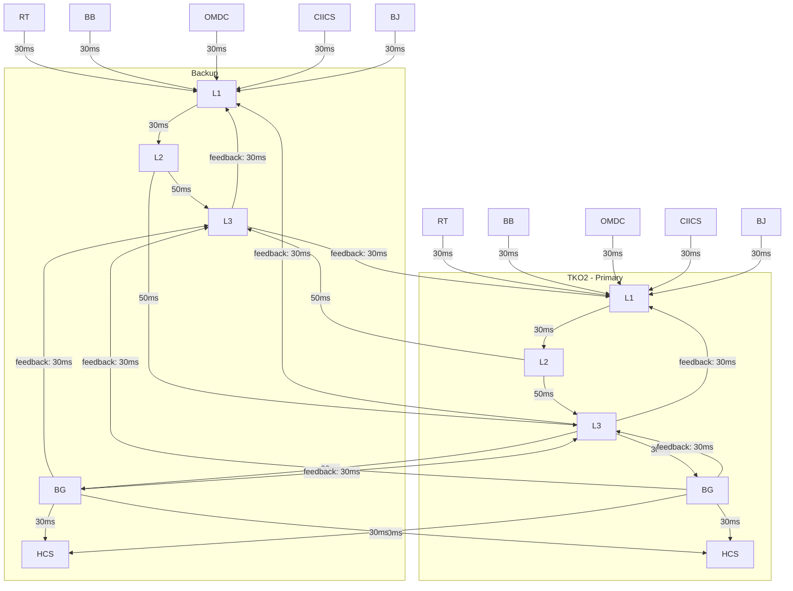

```mermaid
graph TD
      TKO1-RT[RT]
      TKO1-BB[BB]
      TKO1-OMDC[OMDC]
      TKO1-CIIS[CIICS]
      TKO1-BJ[BJ]
  subgraph TKO1[Backup]
      TKO1-L1[L1]
      TKO1-L2[L2]
      TKO1-L3[L3]
      TKO1-BG[BG]
      TKO1-HCS[HCS]
    end

      TKO2-RT[RT]
      TKO2-BB[BB]
      TKO2-OMDC[OMDC]
      TKO2-CIIS[CIICS]
      TKO2-BJ[BJ]
    subgraph TKO2[TKO2 - Primary]
      TKO2-L1[L1]
      TKO2-L2[L2]
      TKO2-L3[L3]
      TKO2-BG[BG]
      TKO2-HCS[HCS]
    end

    TKO1-RT --> |30ms| TKO1-L1
    TKO1-BB --> |30ms| TKO1-L1
    TKO1-OMDC --> |30ms| TKO1-L1
    TKO1-CIIS --> |30ms| TKO1-L1
    TKO1-BJ --> |30ms| TKO1-L1
    TKO1-L1 --> |30ms| TKO1-L2
    

    TKO2-RT --> |30ms| TKO2-L1
    TKO2-BB --> |30ms| TKO2-L1
    TKO2-OMDC --> |30ms| TKO2-L1
    TKO2-CIIS --> |30ms| TKO2-L1
    TKO2-BJ --> |30ms| TKO2-L1
    TKO2-L1 --> |30ms| TKO2-L2

    TKO1-L2 --> |50ms| TKO1-L3
    TKO1-L2 --> |50ms| TKO2-L3
    TKO2-L2 --> |50ms| TKO1-L3
    TKO2-L2 --> |50ms| TKO2-L3

    TKO2-L3 --> |30ms| TKO1-BG
    TKO2-L3 --> |30ms| TKO2-BG

    TKO1-BG --> |feedback: 30ms| TKO1-L3
    TKO1-BG --> |feedback: 30ms| TKO2-L3
    TKO2-BG --> |feedback: 30ms| TKO1-L3
    TKO2-BG --> |feedback: 30ms| TKO2-L3

    TKO1-L3 --> |feedback: 30ms| TKO1-L1
    TKO1-L3 --> |feedback: 30ms| TKO2-L1
    TKO2-L3 --> |feedback: 30ms| TKO1-L1
    TKO2-L3 --> |feedback: 30ms| TKO2-L1

    TKO1-BG --> |30ms| TKO1-HCS
    TKO1-BG --> |30ms| TKO2-HCS
    TKO2-BG --> |30ms| TKO1-HCS
    TKO2-BG --> |30ms| TKO2-HCS
```
